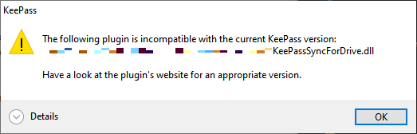

* [Installation](#installation-steps)
* [Upgrade](#upgrading)
* [Troubleshooting](#troubleshooting)
    * [Misloaded Plugin](#misloaded-plugin)
    * [Installation Conflicts](#other-installation-conflicts)

Portable installation is required when the KeePass program is run
from a removable storage device, such as a USB drive.  This is
convenient mostly for those who wish to use KeePass with multiple
computers, without installing it on each of those computers.

This installation method is generally recommended only for advanced users.  It
requires diligence to ensure [system requirements](require) are met for
each computer, and to avoid [installation conflicts](#installation-conflicts).

Alternatively, the ["normal" installation method](normal) may be preferable.

---

#### Installation Steps
Before installing the plugin, ensure that the
[portable KeePass installation](https://keepass.info/help/v2/setup.html#portable)
is valid and operating as desired.

Please also review the general [KeePass instructions for installing plugins](https://keepass.info/help/v2/plugins.html).  

Use the [Download .ZIP](/) button to obtain a file named
KeePassSyncForDrive-x.x.x.zip, where 'x.x.x' is the release version.  For
example "KeePassSyncForDrive-4.0.1.zip" or "KeePassSyncForDrive-4.0.1-beta.zip".

1. Ensure KeePass is not running.
2. If it does not already exist, create a folder under the KeePass
installation folder named "Plugins" (for example, if KeePass.exe is
installed in a folder named "K:\sw\KeePass", ensure the folder
"K:\sw\KeePass\Plugins" exists).
3. Create a new, uniquely named folder under the Plugins folder
(for example, if the Plugins folder of the previous step is 
"K:\sw\KeePass\Plugins", and no folder named "SyncForDrive" exists in
that folder, create the folder "K:\sw\KeePass\Plugins\SyncForDrive").
4. Extract the contents of the .zip file into the folder created in step 3.

Verify that the plugin is installed by starting KeePass and examining the
Tools menu:

{:refdef: style="text-align: center;"}

{: refdef}

To ensure you have the most current version of the plugin, click
**Check for Updates** on the KeePass Help menu:

{:refdef: style="text-align: center;"}

{: refdef}

---

#### Upgrading
To install a new version of the plugin to a portable installation, follow
these steps.

Use the [Download .ZIP](/) button to obtain the latest release' .zip archive.

1. Ensure KeePass is not running.
2. Empty the contents of the folder created in step 3 of the
[portable installation instructions](#installation-steps).
3. Extract the contents of the .zip file into the folder emptied in step 2.

---

#### Troubleshooting

##### Misloaded Plugin

{:refdef: style="text-align: center;"}

{: refdef}

If the above message appears when KeePass starts, check the following:

* Ensure that the [installation requirements](/install/require) are
fully met, particularly with regard to Windows and .NET Framework versions.
The plugin does *not* support other .NET platforms, such as 
[.NET Core](https://dotnet.microsoft.com/download/dotnet-core),
Mono, et. al.
* When installing or upgrading KeePass in portable mode, ensure that
both ``KeePass.exe`` and ``KeePass.exe.config`` are copied from the
release Zip file to the installation folder.  Both files are updated
in each KeePass release, and they must be in sync for
plugins to continue to work after an upgrade.
* See the section below for other installation conflicts.

##### Other Installation Conflicts
If you have previously used the "normal" plugin installation on a machine
where you now wish to use the "portable" installation, you should remove the
prior plugin installation first.  With normal installation, KeePass creates a
plugin cache that must be cleared.  Note that this will prevent the 
plugin from operating in normal, non-portable mode, if KeePass is still
installed that way.

1. Remove the ".plgx" file added to the KeePass directory in Step 1 of the 
[normal installation](normal#installation-steps) instructions.
2. In KeePass, clear the "Plugin Cache" (Tools &#x21D2; Plugins... &#x21D2;
Clear button).
3. Restart KeePass.

