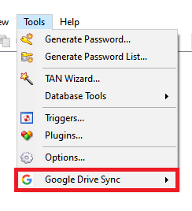
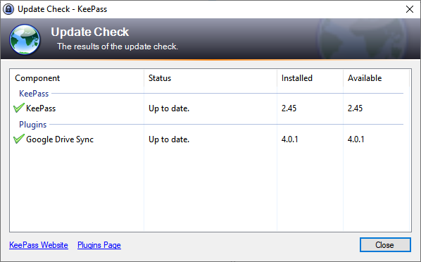
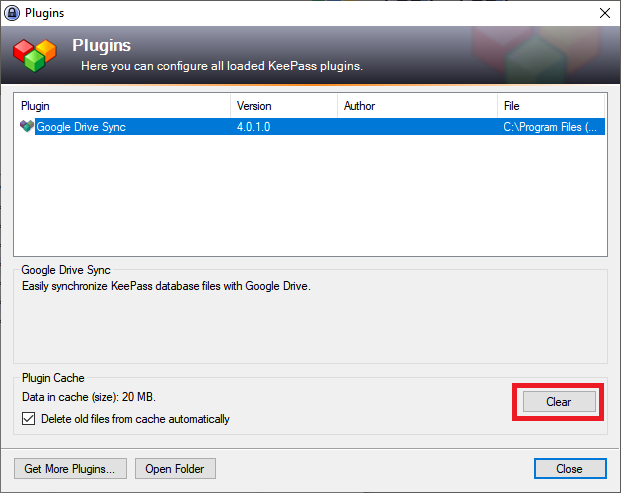

    Earlier versions of the plugin with
    "outlaw" branding (Google Drive Sync and KeePass Sync for Google
    Drive) and expired legacy Google app credentials are 
    <em>much improved</em> by the current release.

Finally, we have a modern release of the rejuvenated *Google Sync 3.0* plugin
with usable, Google-sanctioned, built-in OAuth 2.0 credentials.
This was a primary goal of the project,
and with your feedback and coordination with Google, we can hopefully
look forward to several more years of safely using the plugin without
authorization issues.

Unfortunately a few trivial but necessary cosmetic changes to the
prior releases were demanded in order to get the plugin to this
point.

The upgrade from ALPHA release is simple, but
the details are important to avoid the possibility of multiple
versions of the plugin installed simultaneously.  Follow the links
below to upgrade via your chosen installation method.

And please, don't hesitate to raise a new
[issue](https://github.com/walterpg/google-drive-sync/issues)
if you have problems with the upgrade!

* [What has changed?](#what-changed) (Please review this first.)
* [Upgrading a Normal Installation from ALPHA.](#upgrading-a-normal-installation)
* [Upgrading a Portable Installation from ALPHA.](#upgrading-a-portable-installation)

---
### What Changed
Mostly, just names.  The name of the plugin and the file names of the
distribution binaries have changed from some form of 

##### ~~Google Drive Sync~~
or
##### ~~KeePass Sync for Google Drive~~
to 
##### *KPSync for Google Drive*.
    
All changes to plugin nomenclature are now reflected by [the site](/).

With apologies, the blame for this situation is completely ours.
We failed to anticipate the detailed requirements for verification, and
were caught unaware of KeePass' own branding preferences. 
With any luck, this is the last change of this sort, and more people
will be able to find, use, and improve the plugin.

Now, to the name changes.  Whereas the prior versions displayed one of
these menus...

{:refdef: style="text-align: center;"}

{: refdef}

...the new release's menu looks like this:

{:refdef: style="text-align: center;"}

{: refdef}

Also, the KeePass "Check For Updates" dialog will display one of these
windows when the **old** plugin release is installed...

{:refdef: style="text-align: center;"}

{: refdef}

...whereas the new release will reflect the new name (if not this
version):

{:refdef: style="text-align: center;"}

{: refdef}

---
### Upgrading a Normal Installation
The instructions are the similar to those of the [installation
upgrade](./normal#upgrading) page, with the following changes:

1. Start KeePass.
2. Select the **Tools** ⟹ **Plugins** menu command.
3. Click the **Clear** button:
    

        
Attention:

        The Clear command will delete KeePass' cache of <em>ALL</em>
        plugin assemblies.  You should ensure that any other plugins
        you have installed are refreshed/updated, as you may 
        require, before performing this step.
    

    {:refdef: style="text-align: center;"}
    
    {: refdef}
4. Exit KeePass; ensure you have exited the program by checking
the Windows "notification tray" for the KeePass icon. If it's
still there, KeePass is still running - don't proceed until
the icon is gone.
5. Delete the old .PLGX file(s) from the KeePass installation folder,
for example `C:\Program Files (x86)\KeePass Password Safe 2`.
The files to delete will have one of the old names, something like
`GoogleDriveSync-4.0.1-alpha.2.plgx` or `KeePassSyncForDrive-4.0.4-beta.plgx`.
    

        KeePass also looks for .PLGX files residing
        in or under the <code>Plugins</code> folder,
        e.g., <code>C:\Program Files (x86)\KeePass Password Safe 2\Plugins</code>.
        Ensure all copies of the .PLGX files mentioned above are
        removed.
    

6. Now follow the instructions on the [Normal Installation page](../install/normal#installation-steps).
That is, copy the new plugin file, named something like 
`KPSyncForDrive-4.0.6.plgx`,
to the KeePass installation folder, e.g.,
`C:\Program Files (x86)\KeePass Password Safe 2`.
7. Restart KeePass.

---
### Upgrade a Portable Installation
You are in luck.  The instructions are very similar to the
[usual portable installation upgrade instructions](./portable#upgrading).

In fact, the instructions are identical.  Just note that some of the
files extracted from the new release's .ZIP archive will have
different names.

