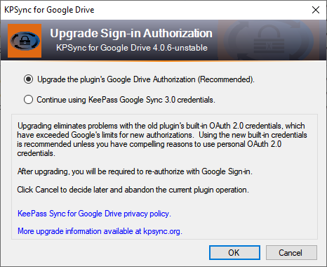
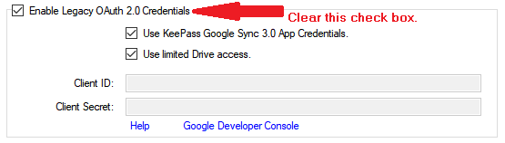

KeePass displays the message below (only once) the first time
the plugin detects that a database is configured to use one
of the legacy authorization methods.  The check occurs when
you use or configure the plugin.

{:refdef: style="text-align: center;"}

{: refdef}

If you do *not* encounter this message, it's all good; continue
using the plugin with the assurance that you are up-to-date.

*KeePass Google Sync 3.0* served us well for many years, but it didn't
keep pace with the modern Google Drive API. Filling that gap and
retaining compatibility was the founding motivation for this project.

* [Why upgrade?](#why-this-upgrade-is-recommended) (Why This Upgrade
Is Recommended)
* [But I'm not having problems, so WHY?](#what-app-credentials-are-and-why-they-changed) (What App
Credentials Are and Why They Need to Change)
* [What does the upgrade do?](#the-automatic-upgrade)
(Automatic Upgrade)
* [Can I do this myself instead?](#manually-upgrading-a-database)
(Manually Upgrading a Database )

---
### Why This Upgrade Is Recommended
The upgrade allows users to access their Google Drive accounts, through
the plugin, without restrictions.  This is important because otherwise
the plugin cannot ensure that it accesses the same KeePass file that
other KeePass programs do, especially other programs running on say,
Android devices.  This can result in inaccurate synchronization or
inadvertent data loss, making the plugin much less than useful.

Upgrading is voluntary.  If you currently have no
problems synchronizing your databases, you may want to postpone it.
Then, when you eventually **do** have problems related to Google
Sign-in, you can either
[manually upgrade](#manually-upgrading-a-database),
or try your luck with the one of the workarounds.

We know that trusting software to not abuse its access to your
Google Drive account can be a *leap of faith*.  But
[we believe](../privacy#plugin-privacy)
that the the *power* of open source software protects you. The plugin
will never delete data or access files other than the ones you specify
to synchronize with your KeePass database.

---
### What App Credentials Are and Why They Changed
The plugin's built-in app credentials, used to interoperate with
Google Sign-in interfaces, allow you to authorize the plugin to
access your Google Drive account.

Google requires that app credentials be authorized by a
verification process. The old plugin cannot pass this test for
several reasons:

* The rules regulating verified apps did not exist, or were less
restrictive, when it was originally released.
* When faced with an earlier form of app verification, the old
plugin's maintainers elected to provide a workaround using
"personal" OAuth 2.0 credentials. This worked well, but in recent
years it has become more difficult to obtain and configure the
credentials required by this workaround.
* The old plugin's maintainers have exclusive access to the old
app credentials, and there is no way to transfer them to the current
plugin's maintainers.
* Even if the old credentials could be transferred, it is unlikely
that Google will verify an app that uses them, because of their
continued use in the old, unverified plugin software.

As a result, synchronizing new databases using the old plugin's app
credentials is not possible. [Some users unexpectedly find that
their databases are no longer usable](../usage/authorize#authorization-tokens)
without workarounds provided by this and the previous plugin. 

Unfortunately, workarounds like personal credentials, or "limited
access" authorization, bring their own difficulties, such
as [file duplication](https://github.com/walterpg/google-drive-sync/issues/12)
and complex configuration steps, which most users, and especially
*new* users, would rather not endure.

#### The New Built-in Credentials
The Google-verified, built-in credentials used by the new plugin
are *not* subject to the quota limits and security warnings which can
occur with "personal" OAuth 2.0 credentials.  And unlike the legacy 
plugin credentials, the new built-in credentials *actually work*,
with your explicit consent, in new database configurations, and in 
databases with revoked authorization tokens. 

---
### The Automatic Upgrade
If you upgrade, the plugin will from then on use its own,
Google-verified OAuth 2.0 credentials each time it uses the Google
Drive API.  

The upgrade also removes any current authorization token obtained
either by the old plugin, or by this plugin via the workarounds.
Again, if you currently don't have synchronization problems with
the new plugin, you can elect to ignore the upgrade now, while still
retaining the option to [manually upgrade](#manually-upgrading-a-database)
later. You will only be nagged by the above message once.

But whether you do it now or later, the new credentials will require
re-authorization, so you will be prompted to authenticate your
account with Google Sign-in when you run a sync command after the upgrade.

---
### Manually Upgrading a Database
If you want to upgrade to the new credentials manually, simply open
the Configuration dialog, disable "legacy credentials" as shown below,
and click OK.

{:refdef: style="text-align: center;"}

{: refdef}

The next time you synchronize, you will have to authorize via Sign-in,
just as you did the first time you used the database.