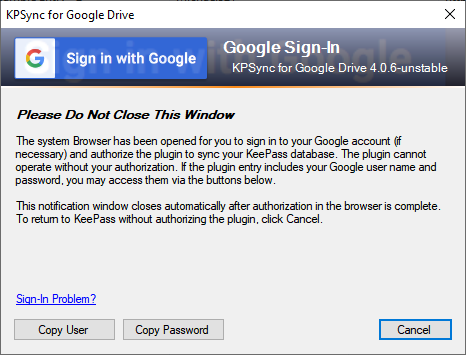
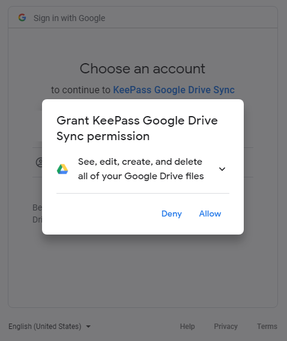
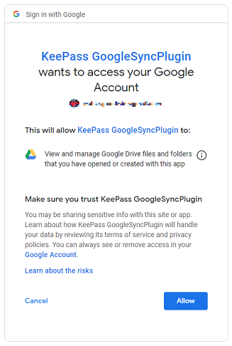
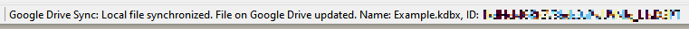
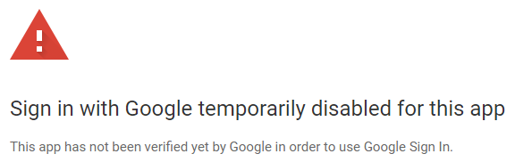

One way in which Google have improved the security of Google Drive
APIs in the last few years is by eliminating support for
older browsers and authentication mechanisms. For this reason, the
plugin is enhanced with approved techniques using
Google Sign-in.

Successful authorization results in Google issuing an authorization
token - thus you usually only need to authorize a new database once.

* [Authorization Walkthrough](#authorization-walkthrough)
* [Authorization Errors](#authorization-errors)
* [Authorization Tokens](#authorization-tokens)
  * [Database-Stored Tokens](#database-stored-tokens)
  * [Session-Stored Tokens](#session-stored-tokens)

---

#### Authorization Walkthrough

When you invoke a sync command from the plugin menu, the plugin
will determine if first you need to authorize.  If so, it will
display this prompt window:

{:refdef: style="text-align: center;"}

{: refdef}

This prompt notifies you that your consent is needed to operate
the plugin. Because the plugin also opens the Windows-default
web browser application, the prompt and KeePass may become hidden
behind the Google Sign-in page display. The image below shows
the plugin waiting for the user enter credentials in the 
Google Sign-in page.  The Google Sign-in page may have a different
appearance if the browser is already signed on to Google.

{:refdef: style="text-align: center;"}

{: refdef}

    Note that the plugin prompt dialog provides <b>Copy User</b> and
    <b>Copy Password</b> buttons.  If the
    <a href="../install/config">configured</a>
    plugin entry contains your Google credentials, these buttons
    are enabled. Clicking them invokes the KeePass clipboard
    copy function, to facilitate data entry in the Sign-in page.

After you successfully sign on in the browser, the Google authentication
service may prompt you confirm your consent, showing a page similar
to the image below:

{:refdef: style="text-align: center;"}

{: refdef}

While this warning is true, please understand that the plugin only
accesses Drive files that have the same name as your KeePass
database file.  The plugin does not access, create, or delete any
Drive file or folder except the KeePass database it is [configured](../install/config)
to access.  

If you click **Allow** above, you may then be prompted to affirm, as 
shown:

{:refdef: style="text-align: center;"}

{: refdef}

After you click **Allow**, the browser will show a "return to KeePass"
message.  The plugin will automatically close the prompt dialog, and
begin processing the command that initiated the authorization sequence.
If the command was [Sync with Drive](sync), KeePass will show
a message in its status bar after the command completes successfully,
such as shown below.

{:refdef: style="text-align: center;"}

{: refdef}

---

#### Authorization Errors

If Google Sign-in does not authorize the plugin,
the browser may display an error such as this:

{:refdef: style="text-align: center;"}

{: refdef}

If this or a similar error message appears, try
the following configuration options:

* Disable "legacy" credential options (this should always work).
* If you must use legacy credentials, enable the
[**Use Limited Drive Access**](x-40#limited-drive-access) option.
* Supply [your own OAuth 2.0 credentials](../usage/oauth).

    The legacy
    <a href="https://sourceforge.net/projects/kp-googlesync/">
    <em>KeePass Google Sync Plugin 3.0</em></a> built-in credentials 
    have been replaced, making obsolete the <b>Use Limited
    Drive Access</b> workaround, and personal OAuth 2.0 credentials.
    It is highly recommended to disable the legacy credentials
    option and use the new built-in credentials.

---

#### Authorization Tokens
When you successfully [authorize](#authorization-walkthrough),
the plugin engages the Google Sign-in service to obtain an
*authorization token*. This token is proof of your consent, and 
the plugin can use it in subsequent requests to use the Google
Drive API on your behalf.  The authorization token allows the
plugin to perform sync commands without requiring you to
Sign-in each time.

The plugin optionally handles authorization tokens in two ways:
*session*-stored tokens, and *database*-stored tokens.
In prior plugin releases, only database-stored tokens were
available.  Session-stored tokens are now offered as way to avoid
situational [security issues](/notices/sharedsec)
associated with database-stored tokens.  Each KeePass database
you use can be
[configured for either handling option](/install/config#sync-authorization),
and the plugin offers
[global token handling options](/install/config#options-and-defaults)
to manage authorization tokens in all databases.

Regardless of the reason for an invalid token or its storage
scheme, the plugin always initiates the
[authorization sequence](#authorization-walkthrough)
to obtain a valid token when necessary.

##### Database-Stored Tokens
This option saves the authorization token in the KeePass database
along with other plugin configuration data.  This is enabled per
database, by clearing the
[**Do not save Google Drive Authorization in the database**](/config#sync-authorization)
check box in the
[configuration dialog](/config#configuration-window).

    

        <a href="/notices/sharedsec">SECURITY ALERT</a>
    

    KeePass databases synchronized using this option, then
    <em>shared with partially-trusted users</em>, could present a security hazard.
    <a href="/notices/sharedsec">Please review the details</a> to
    ensure safe use of the plugin.

The main advantage of this is that the token can be reused 
indefinitely, across many KeePass sessions.  
Very often, you may never need to authorize the plugin with Google
Sign-in more than once.  Occasionally however, reauthorization may
be required. There are usually only two conditions which require
the plugin to replace a token that is saved in the database:

* Syncing a new database.
* Expired, revoked, or retired authorization tokens saved in an existing
database.

The latter case can occur when an authorization granted to
this or the old plugin expires, or is inadvertently revoked by a Google
["security checkup"](https://myaccount.google.com/security-checkup)
initiated by an unwary user.  You may also manually revoke any authorization
granted to the plugin by following the steps mentioned in the
**Remediation** section of the [security bulletin](/notices/sharedsec#remediation).

##### Session-Stored Tokens
Session-stored authorization tokens are not saved to the database.
They are only available to the current KeePass session - as soon as you
exit KeePass, any session-stored tokens are discarded.  Thus, the next
time you run KeePass and synchronize a database, you will be prompted
to authorize via Google Sign-in. Enable this option by selecting/checking the
[**Do not save Google Drive Authorization in the database**](/config#sync-authorization)
check box in the
[configuration dialog](/config#configuration-window).

While session-stored tokens are obviously less convenient than 
the database-stored tokens, the option may provide peace of mind to
security-conscious users in sensitive environments.  In particular, groups
who wish to safely share a KeePass database and its credentials, but not
share a single Google Drive account, can benefit from this feature.
