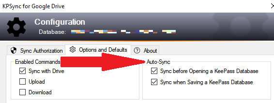

{:refdef: style="text-align: center;"}

{: refdef}

Sync every time you open or save the database.

## What Happens
* If **Auto Sync** is enabled for the KeePass **Open** command, then each time you open a 
database, the **Sync with Drive** function is invoked automatically, thus
ensuring any changes made to the Drive copy since the last time you used the
database are merged into the opened database.
* If enabled for the KeePass **Save** command, any changes made in your current KeePass session are saved *and* merged into the Drive copy.

## How it Works
* Click [**Configuration**](../install/config#configuration-window) on the
plugin menu to open the dialog, then the
[**Options and Defaults** tab](../install/config#options-and-defaults)
shown above.
* The **Sync with Drive** command must be enabled.
* You can enable **Auto Sync** for the **Open** command, **Save** command, or both.
* KeePass notifies the plugin when you **Open** or **Save**, and the plugin invokes the **Sync with Drive** command if enabled.
* **Auto Sync** only works if the current database is configured for the plugin,
and if the **Sync with Drive** function is enabled.
* **BEWARE:** KeePass features such as [auto-lock](https://keepass.info/help/base/security.html#seclocking) save changes then immediately close the database, preventing the plugin from automatically syncing.  In such cases, you can optionally defer **Auto Sync** until the database is reopened.  For more details, see [**Deferred Auto Sync**](#deferred-auto-sync) below.

## Deferred Auto Sync
KeePass' [auto-lock](https://keepass.info/help/base/security.html#seclocking) and related features interfere with the operation of the **Auto Sync** on **Save** option.  To help ensure minimal impact to **Auto Sync** operations, the plugin implements a "deferred sync" option when the condition is detected.

Windows offers several built-in login security features, including automatic idle and other event-based screen locks.  When paired with <em>secure</em> login credentials, these features may be useful alternatives to KeePass' auto-lock.

KP auto-lock automatically closes databases as a security precaution, based on several configured criteria (for example, when an idle timer elapses).  When there are unsaved changes to the database and auto-lock is engaged, KeePass runs its **Save** command to save the changes. Unfortunately, KeePass immediately closes the database after this implicit **Save** is complete, preventing the plugin from performing its **Auto Sync**. 

Even though **Auto Sync** on **Save** is enabled, the plugin cannot sync the database before KeePass closes it, especially if the auto-lock is performed as part of another security operation, such as a screen lock. The KeePass "save changes on exit" feature is another source of this problem, since not only is the database closed - the KeePass program itself is terminated.

One way to deal with the issue is to enable the **Auto Sync** on **Open** option.  Thus, when the file is opened after auto-lock, the plugin will run a sync operation.  However, the **Auto Sync** on **Open** option applies to *all*  **Open** commands, rather than only those "reopens" following auto-lock operations that implicitly save changes.

Fortunately, there is another alternative.  The plugin is able to detect situations where the sync cannot be performed.  When such events occur, the plugin marks the database, prior to the save, as a reminder that **Auto Sync** was preempted. When the database is subsequently reopened, the plugin can either:
* Notify you of the condition, and at your discretion proceed with the deferred sync, or 
* Automatically perform the deferred sync operation without your intervention.

The first option will display the message below when an auto-locked or saved-on-exit database is reopened.  Usually the safest response is to click **Yes**, however you may be aware of changes sync'ed on other devices that might cause interference.  Clicking **No** allows you to review the contents of the database before syncing later:

{:refdef: style="text-align: center;"}

{: refdef}

To have the plugin perform deferred sync ops automatically when the database is reopened, enable the **Resume on return from Auto-Lock** option.  Essentially this is the same as the plugin automatically clicking **Yes** to the dialog above.  You can select this option on the Configure dialog as shown:

{:refdef: style="text-align: center;"}

{: refdef}

Note: The <b>Resume on return from Auto-Lock</b> checkbox is only enabled when the <b>Auto Sync</b> on <b>Save</b> option is enabled.  The <b>Resume on return...</b> option was first available in version 4.0.7-beta.

Disabling the resume option causes the plugin to revert to showing the message window each time the deferred sync condition is detected upon reopen.

