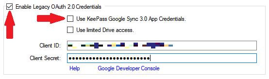

This feature is retained for compatibility only.
The use of legacy authorization methods, employing either personal or
<em>KeePass Google Sync 3.0</em> app credentials, should no 
longer be necessary for most users.

This workaround was devised in the
[legacy plugin](https://sourceforge.net/projects/kp-googlesync)
to allow you to use your own, Google provided
[OAuth 2.0](https://oauth.net/2/) client
credentials.  With the prior, Google unverified plugin there were
legitimate reasons for doing this:

* If you don't share the credentials with anyone, then no non-mechanical
third party can use them - they are a secret between you, Google, and the
KeePass program running on your PC.
* Though well protected, and only useful with your expressed permission,
the built-in credentials could be compromised by unintended neglect or
nefarious means, and used to spoof the plugin's request for authorization.
* [OAuth 2.0](https://oauth.net/2/), and Internet protocols in general,
are *never* impervious to attack by determined third parties.  Some users
may find some (likely displaced) solace by supplying, their own
"personal" OAuth 2.0 credentials.

To transparently support users of the legacy plugin there is a **very**
valid reason for doing this:

* *KeePass Google Sync 3.0* plugin was not verified by Google, and so
it has exceeded its validation limits.

If you have OAuth 2.0 [client credentials](https://www.oauth.com/oauth2-servers/access-tokens/client-credentials/)
in the form of a `client_id` and `client_secret`, you can configure the
plugin to use these to authorize plugin commands with the current database
by entering them in the appropriate text boxes of the **Sync Authorization**
tab of the Configuration dialog.  Ensure that the **Enable Legacy OAuth
2.0 Credentials** check box is checked, and the **Use KeePass Google Sync
3.0 App Credentials** checkbox is unchecked to enable the text boxes.

    
WARNING

    When you change OAuth 2.0 credentials, the next time you use a
    plugin command you will be forced to reauthorize, by authenticating
    your Google account.

{:refdef: style="text-align: center;"}

{: refdef}

If you wish, you may also enter the credentials in the similar text boxes
of the **Options and Defaults** tab.  In this configuration, the plugin will
use the supplied credentials in all new databases.

---
#### Obtaining Personal OAuth 2.0 Credentials
Google currently allows any user to [obtain OAuth 2.0 client credentials](https://developers.google.com/identity/protocols/oauth2)
for access to its Drive and other APIs.  The process for doing so is designed
for developer use, and it changes periodically.  

Google could discontinue access to personal OAuth 2.0 credentials in the future.
But as of this writing, the procedure generally it goes like this:

1. Log on to the [Google Cloud API Console](https://console.developers.google.com/).
2. Use the "Create a Project" link to create a space for your credentials.  
Name it something and click CREATE.
3. Click the "Credentials" link, then "CREATE CREDENTIALS".  A menu or 
screen appears.  Select "OAuth client ID" or something similar.
4. Click through various forms, including a configuration of the consent screen
that Google will display when you use the credentials.  This will help you
identify the use of the credentials later. 
5. Again, click "Credentials", then "CREATE CREDENTIALS". You may have to
enter yet more info, particularly "Application type", which you should indicate
as "other" or "native" (not "web" or "mobile").  Finally, click CREATE.
6. A screen showing your new credentials (the text named "client ID" and "client
secret") should appear.  Copy the credential somewhere safe (hi there KeePass!).
