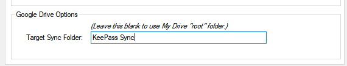

{:refdef: style="text-align: center;"}

{: refdef}

Sync your database with a file in a specific Drive folder.

## What Happens
* Specify a folder of your choice to contain the Drive file to sync with. 
The folder may be [nested](#specifying-subfolders) in any other folder.
* Or don't specify a Target Folder; if you leave this blank, the plugin
looks for a *single* Drive file, among all folders, with the same name as
the database.
* Specifying a Target Folder allows you to maintain multiple copies of the
database file in other Drive folders. If not specified, the plugin will
expect to find only one Drive file with the same name as the database among
all of your Drive folders.
* If the specified folder does not yet exist, the plugin creates it for you.
* Be aware of certain Drive [pitfalls](#target-folder-names-must-be-unique).

## How it Works
* Click [**Configuration**](../install/config#configuration-window) on the
plugin menu to open the dialog and select the **Sync Authorization** tab.
* Clear the **Target Sync Folder** text box to sync as in Google Sync 3.0;
that is, with one copy of the database file, in any folder, across all your
Drive folders.
* Enter a Drive folder name in **Target Sync Folder** to sync the database
to that folder.
* To specify the My Drive folder, or a nested folder, enter the folder
using the [file separator syntax](#specifying-subfolders).
* If a specified folder or any of its "parent" folder(s) do not exist, the
plugin will create them as part of the sync operation.
* If the plugin detects any ambiguity in the Target Folder (e.g., multiple
folders with the same name, or multiple copies of the database file
in the Target Folder), the operation is cancelled an a error message is 
shown.
* Similarly, if no Target Folder is specified, but multiple copies of the
file exist anywhere in Drive, the operation is cancelled an an error message
is shown.
* To use a specific Target Folder in future KeePass databases, enter the
folder in the **Default Target Sync Folder** text box on the
[**Options and Defaults**](../install/config#options-and-defaults) tab of the
Configuration dialog.

## Target Folder Names Must be Unique
One of the odd "features" of Google Drive is that multiple objects with
the same name can exist within a single folder, including the special
My Drive folder.  Therefore, the Target Folder you specify must have a 
unique ["path"](#specifying-subfolders) in your Drive account, or the
plugin cannot determine which folder or file to sync with.

If you target a top-level folder named "KeePass", but two separate folders
with that name are accessible, the plugin can't select the correct folder
on its own, and an error occurs when you sync. Similarly, if the Target Folder
contains two or more copies of the database file (with the same name), the
plugin will refuse to sync.

## Specifying Subfolders
The Target Folder may reside in any other folder, not just the My Drive
top-level folder.  To specify a subfolder as a Target Folder, use the 
common "file separator" syntax of traditional file systems.  The file
separator can be either '/' or '\\'.  For example:

* **KeePass/social/clubs** specifies a folder named "KeePass" at the
top-level, containing a subfolder named "social", which itself contains
a subfolder named "clubs".  The Target Folder is "clubs".
* **KeePass\social\clubs** specifies the same Target Folder but using
an alternate separator character.

## Specifying My Drive
To use the top-level **My Drive** folder as the Target Folder, enter a single
separator character in the text box, e.g., **/**. Note that this is not
the same as leaving **Target Sync Folder** empty!

## Special Cases
Folders names in Drive may be composed with any available character, including
the characters used by the plugin to denote nested folders.  For example, 
suppose you want to specify a folder named **My/odd\folder** (yes, this is
allowed in Drive!).  Note that this isn't a path of nested folders, this is
a folder named with separator characters. To specify this as the Target Folder,
you must use the '\\' character to "escape" the embedded separator characters,
so that the plugin does not confuse them with actual separators.  In this case,
the Target Folder specification would be **My\\/odd\\\\folder**.  The '\\'
character must precede each embedded separator character in a folder name.

