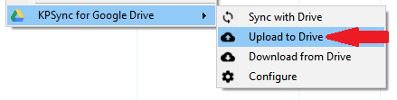

{:refdef: style="text-align: center;"}

{: refdef}

    
CAUTION

    This command <em>replaces</em> the contents of the Drive file, if it exists,
    with the contents of the current database.

## What Happens
* Database changes (if any) are saved.
* The local file is uploaded to Drive.
* If the database file already exists on Drive, its contents are overwritten
with the contents of the local file.
* If the database file does not exist on Drive, it is created.

## How it Works
* The KeePass Save command is invoked.
* The plugin, with your [authorization](authorize), accesses
Drive.
* The Drive file is created or replaced with the uploaded contents of
the local file.
* The database on Google Drive is now a duplicate of the current database.