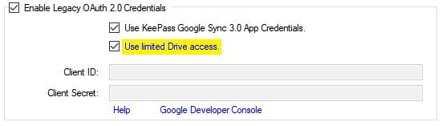
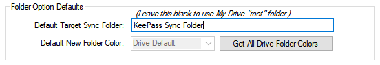

There are a few new plugin features that explore the ancillary
functions of the Google Drive API, or were intended to be temporary
workarounds.  These include functionality the developers find
"interesting", but further practical use and development is likely needed.
As always your feedback is appreciated.

* [Limited Access](#limited-drive-access)
* [Designated Folder Options](#designated-folder-and-folder-colors)

---

### Limited Drive Access
This feature, given the current integration functionality and access
policies of Google Drive, falls into the category of "workarounds".  

{:refdef: style="text-align: center;"}

{: refdef}

On the **Sync Authorization** tab of the **Configuration** window, the
**Use limited Drive access** check box specifies how much access, with
your authority, the plugin requests from Google Drive.  Note that you 
must check the **Enable Legacy OAuth 2.0 Credentials** check box first.

If **Use limited Drive access** is unchecked, the 
plugin requests *unrestricted* access to all files and folders (this is the
traditional access mode used by the old plugin).  If checked, the plugin
will request more restrictive access: only those files which are created,
or previously accessed by the plugin can be accessed in this mode.  

    
WARNING

    Enabling the limited access option may result in unavoidable 
    <b>duplication</b> of files and folders in Drive.  If enabled,
    <em>you</em> must ensure that the objects you are synchronizing are
    not duplicates, using a
    <a href="https://drive.google.com" class="alert-link text-dark">
    full access Drive interface</a>.

Google Drive, unlike most traditional file systems, allows creation of
objects that have the same name, at the same folder level.  If this
option is enabled, and a target file and/or folder with the same name
exists which was created by you or another application, the plugin will
create a new file and/or folder with the same name.  Since the plugin
does not have permission to access the  pre-existing object, it 
cannot detect its presence, and so duplication occurs on sync.  

The only way to avoid this is to ensure that the plugin creates the
file and/or folder *first*, then access the plugin-created objects
with other apps.

The main motivation for this feature was to allow the plugin to 
continue to work with the old plugin's built-in, but "unverified",
OAuth 2.0 app credentials. After Google changed policies with regard
to unverified app access, users were faced with the choice of using
this access mode, or obtaining and using
[personal OAuth 2.0 credentials](oauth). There are reports of
success with both alternatives. 

    This project aims to submit a revised plugin to Google for
verification.  Therefore the limited access feature is
a candidate for deprecation in future releases.  Still, some may
consider this a security feature, to prevent any
chance for the plugin to access sensitive files.  Please share your 
experiences so we can all better understand the utility of the feature
going forward.

Please note that beyond the "workaround" utility, the feature may only
provide false security, incompatibility, and confusion, for at least
two reasons.

First, the limited or restricted access mode does not integrate well
with other KeePass compatible software that use Drive hosted sync files,
in particular, Android and other mobile apps).  Since other apps
often have "full" access, the duplication issue mentioned above may
occur.

Second, the plugin's behavior is verifiably benevolent, and its [use of
your account](../privacy#plugin-privacy) is well documented here and in
the code. Only the files and folders that you direct it to are accessed,
simply by the name of the database file, and if given, a 
folder it resides in (see next section), and *nothing more*.

---

### Designated Folder and Folder Colors
This feature allows you to specify a particular top-level folder to
contain the Drive files synchronized by the plugin, providing a
degree of tidiness in Drive archives.  The plugin
will only synchronize the current database with files contained in
this Drive folder.  The setting is found in the **Sync Authorization**
tab of the Configuration window.

{:refdef: style="text-align: center;"}

{: refdef}

If no folder is specified, the plugin reverts to the traditional
behavior of using the Drive "root" to access files.  You may also set a 
"default" folder name, to be used by new database sync configurations,
in the **Options and Defaults** tab, shown below.

{:refdef: style="text-align: center;"}

{: refdef}

The Drive API also allows clients to create folders with one of 
several colors, as viewed in the Drive web interface.  The
plugin offers this option as well.  On the "**Options and Defaults**"
tab, you can specify the color of your choice for folders created
by the plugin.  Existing folder colors can only be directly changed in
the web interface.  To select from the available colors, you must first
open a KeePass database that has been configured and authorized to
synchronize.

    To view all available Drive folder colors, you must first
open a KeePass database that has been configured and authorized to
synchronize.  Then click the <b>Get All Google Folder Colors</b>
button.

    The <b>Default New Folder Color</b> setting only applies to folders
    <em>created</em> by the plugin.  The Google Drive API does not offer
    applications a way to change the color of existing folders.

