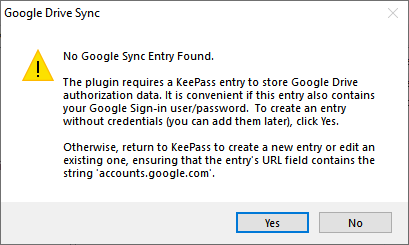
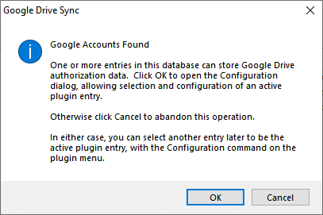
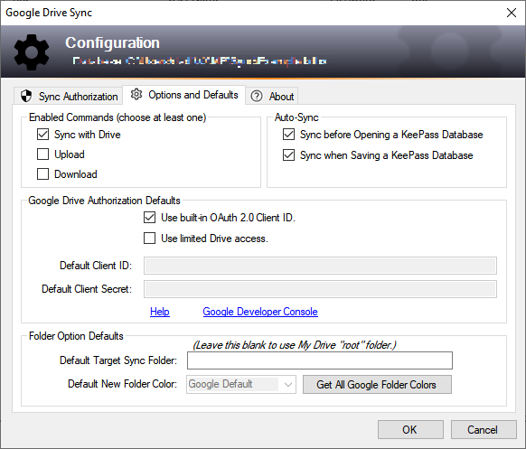

* [First Time Walkthroughs](#syncing-your-database)
* [Upgrading from Google Sync 3.0](#databases-configured-to-use-keepass-google-sync)
* [The Configuration Window](#configuration-window)
    * [Sync Authorization](#sync-authorization)
    * [Options and Defaults](#options-and-defaults)

To understand the plugin's settings system or to synchronize your first
database, please review the [walkthroughs](#syncing-your-database).
Users familiar with Google Sync Plugin 3.0 should also find
this information useful.

The **Configuration** window customizes the plugin's
authorization and other settings for the current database, and sets
default configurations for all new databases that will be used with the
plugin. 

* [Database-specific configuration](#sync-authorization)
* [Default configuration for new databases](#options-and-defaults)

---

### Syncing Your Database
So you just [installed](../install/normal) the plugin, and are ready to sync.

Maybe you are a veteran of the Google Sync 3.0, or perhaps
this is the first time you have used a plugin to [Sync with Drive](../usage/sync).
These short walkthroughs may be helpful.

* [New or Unconfigured Databases](#new-databases)
* [Databases previously used with Google Sync 3.0](#databases-configured-to-use-keepass-google-sync)

To get familiar with the plugin's new Google Drive authorization flow,
new users (and users with new databases) should also review the 
<a href="../usage/authorize#authorization-walkthrough">authorization walkthrough</a>.

---

#### New Databases
The first time you sync a database, the plugin searches for an entry to
store its configuration data.  Each entry's URL field is searched
for a value containing this name: ``accounts.google.com``. If no such entry
is found, the plugin offers to create one for you.  

{:refdef: style="text-align: center;"}

{: refdef}

Unless the database contains an entry with the required
<code>accounts.google.com</code> URL value, any attempt to use the
plugin will display the above message until you (or
the plugin) have created it.

However, if the database already contains entries with the
``acounts.google.com`` URL value, those entries are searched for plugin
configuration information.  If this is a new or unconfigured database, 
the information will not be found, and you will be prompted to configure
the entry of your choice:  

{:refdef: style="text-align: center;"}

{: refdef}

This **Google Accounts Found** message briefly explains the two
alternatives to configure a plugin entry in this case.
* Click OK to [configure](#configuration-window) one of the found entries. 
* Click Cancel, then delete or modify the KeePass entries with the
``accounts.google.com`` URL field values. Then, try to sync again
and let the plugin create an entry by consenting to the former
**No Google Sync Entry Found** prompt.

Regardless of how the plugin entry is created for new databases, it is 
highly recommended that the chosen KeePass entry include your Google Drive
user name and password, so that when the plugin needs your permission for
authorization you can access those credentials from KeePass, via the plugin's
wait window, and enter them into the Google Sign-in page.

---

#### Databases Configured to use KeePass Google Sync
If the database was previously synchronized with Google Sync 3.0,
the plugin will find the old configuration, copy it, and adopt this as its own.
If there is a *valid* [authorization token](../usage/authorize#authorization-tokens)
in the old configuration, you will be able to synchronize exactly as before
without needing to re-authorize.

If you haven't used the old plugin for some time, or if you have recently
experienced problems with the old plugin, you may be required to
authorize the new plugin.  [Please review the authorization issues topics
for guidance](../usage/authorize).

    <a href="../install/require#compatibility-with-google-sync-plugin">
        Compatibility
    </a>
    with Google Sync 3.0 is a primary feature of 
    the new plugin.

---

#### Configuration Window
* [Sync Authorization](#sync-authorization)
* [Options and Defaults](#options-and-defaults)

The plugin menu's **Configuration** command opens a dialog that lets you
choose various settings for the current database, as well as some global
settings affecting new databases and general plugin operation.  An **About**
tab displays the plugin version and credits.  

{:refdef: style="text-align: center;"}

{: refdef}

All settings available here are editable, but the current settings are not
changed until you click **OK**; clicking **Cancel** discards any changes
made in the dialog window.

##### Sync Authorization
The **Sync Authorization** tab contains the settings specific to the current
database, mostly with regard to authorizing the plugin to sync with
Google Drive.

**KeePass Entry Title** is a list box that displays the Title field of
KeePass database entries eligible to be the "active" plugin entry.  The
entry you select here is where the plugin will store the [authorization
token](../usage/authorize#authorization-tokens), and other settings.

{:refdef: style="text-align: center;"}

{: refdef}

Eligible entries are those where the URL field contains the name
``accounts.google.com``, as mentioned in the [New Databases](#new-databases)
section above.

    
NOTE

    Changing the active entry, or any other authorization setting,
    nullifies any previously obtained consent to your Google Drive account,
    and you will be forced to authenticate and re-authorize the
    plugin the next time you run a sync command.

**Google Drive Authorization** is where you specify the app credentials
the plugin will use to authorize access.  

{:refdef: style="text-align: center;"}

{: refdef}

Google requires apps such as the
plugin to use OAuth 2.0 credentials, which they have issued,
to obtain in-app access to your Drive account.  These credentials only
give the plugin the ability to ask your consent to access; you still
must prove to Google, at least once, that you own the account (through
Google Sign-in), and that you allow access to the plugin (through the
authorization page shown after successful sign-in).

Checking the the **Use built-in OAuth 2.0 Client ID** check box will
cause the plugin to use credentials it has been issued by Google. Currently,
these are the legacy credentials used by Google Sync 3.0.

Clearing the check box enables the **Client ID** and **Client Secret**
text boxes, in which you must enter [your own Google issued OAuth 2.0
credentials](../usage/oauth), if you wish to authorize the plugin that
way.

The **Use limited Drive access** check box determines the
[permission level you allow the plugin when accessing Drive](../usage/x-40#limited-drive-access).

In the **Google Drive Options** group is a [new feature](../usage/x-40#designated-folder-and-folder-colors), **Target Sync Folder**,
to specify a top-level folder in Drive where the plugin synchronizes
your database files.  Leave this blank for the traditional top-level
location of your synchronized databases.

{:refdef: style="text-align: center;"}

{: refdef}

##### Options and Defaults
This **Configuration** tab contains settings pertaining to all databases
used with the plugin, and default settings for new databases.

{:refdef: style="text-align: center;"}

{: refdef}

[**Enabled Commands**](../usage/enabled-cmds) lets you choose the commands
you want to use with the plugin, and the commands you would rather disable.

The [**Auto-Sync**](../usage/autosync) group are options to completely
automate the [Sync with Drive](../usage/sync) command by invoking it
automatically when Saving or Opening a database.

The **Google Drive Authorization Defaults** are similar to the settings
of [Google Drive Authorization](#sync-authorization) group on the 
**Sync Authorization** tab, but instead of affecting the current database,
these settings will be adopted by any [new database](#new-databases) you
use the plugin with.

The **Folder Options Defaults** settings are also similar to the **Google
Drive Options** group on the **Sync Authorization** tab, but again, 
apply to new databases created with the plugin.   

The **Default New Folder Color** option provides a way for the plugin to
colorize folders created by the plugin. For more information on this and
other folder-related features, please review the
[**Designated Folder**](../usage/x-40#designated-folder-and-folder-colors)
topic.

