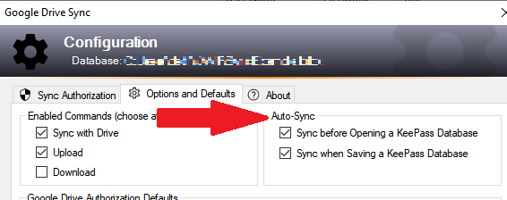

{:refdef: style="text-align: center;"}

{: refdef}

Sync every time you open or save the database.

## What Happens
* If **Auto Sync** is enabled for the KeePass **Open** command, then each time you open a 
database, the **Sync with Drive** function is invoked automatically, thus
ensuring any changes made to the Drive copy since the last time you used the
database are merged into the opened database.
* If enabled for the KeePass **Save** command, any changes made in your current KeePass
session are saved *and* merged into the Drive copy.

## How it Works
* The **Sync with Drive** command must be enabled.
* You can enable **Auto Sync** for the **Open** command, **Save** command, or both.
* KeePass notifies the plugin when you **Open** or **Save**, and the plugin invokes
the **Sync with Drive** command if enabled.
* **Auto Sync** only works if the current database is configured for the plugin,
and if the **Sync with Drive** function is enabled.